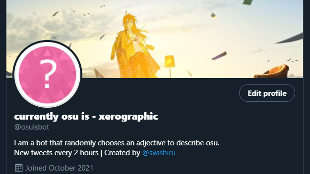
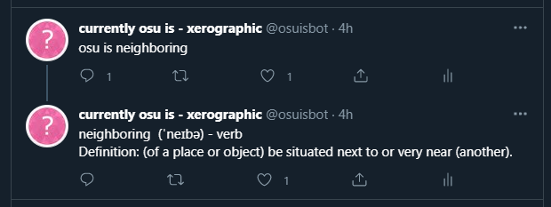

# osu-is bot

<p align="center">
  
  
</p>


This twitter bot was created to randomly choose an adjective to describe the rhythm game [osu](https://osu.ppy.sh). It tweets on 2 hour intervals.

## Installation

Firstly, clone this repository.

```bash
git clone https://github.com/swishyy/osu-is-bot.git your-project-name
cd your-project-name
```

Install the packages using yarn or npm.

```bash
npm install
```

```bash
yarn
```

Populate a .env file with your API Keys and Access Tokens. (These can be obtained by apply for a twitter developer account [here](https://developer.twitter.com/en/apply/user.html).

```.env
API_KEY=YOUR_API_KEY
API_SECRET=YOUR_API_SECRET
ACCESS_TOKEN=YOUR_ACCESS_TOKEN
ACCESS_TOKEN_SECRET=YOUR_ACCESS_TOKEN_SECRET
```

## Usage

Run index.js using node.

```bash
node index.js
```

## Contributing
All pull requests are welcome

## License
[MIT](https://choosealicense.com/licenses/mit/)